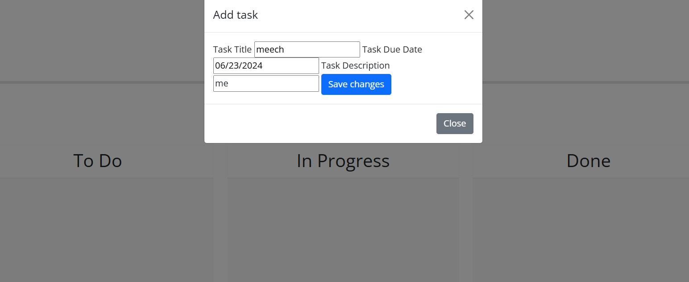

# honeydew-list

## Information
This application is a simple Kanban board for task management. This board is designed to display your task and its due dates. After submitting your text in the add task button, your data will be added to the local storage of your device and removed once you delete the task from your board. The challenges I faced in this project was getting the data display on the board and indicating if its past due or not. 

### To Application

(https://kydrian.github.io/honeydew-list/)

#### Resources
Thank you to my professor Dan, and Sal at UNCC Bottcamp for being great instructors. Thank you to my TA Sasha for helping me debug issues with my code during office hours. Lastly, thank you to my fellow collegues for comig togther to share ideas. 

